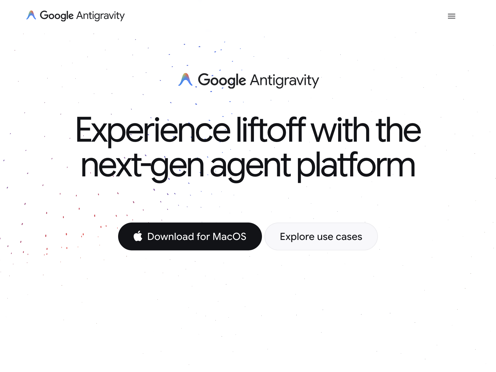
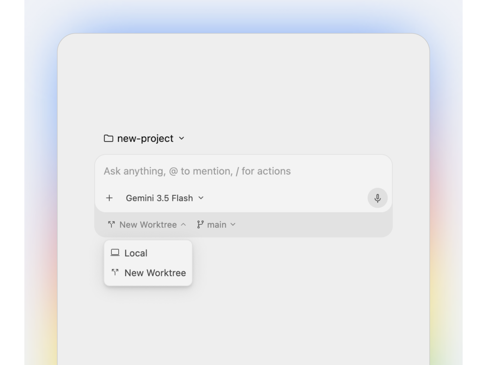
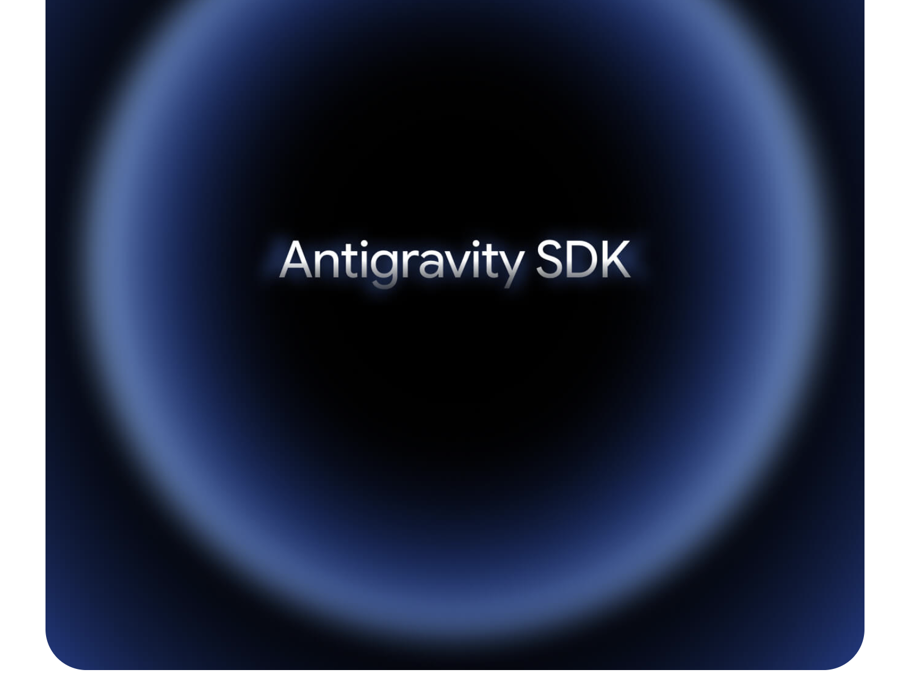
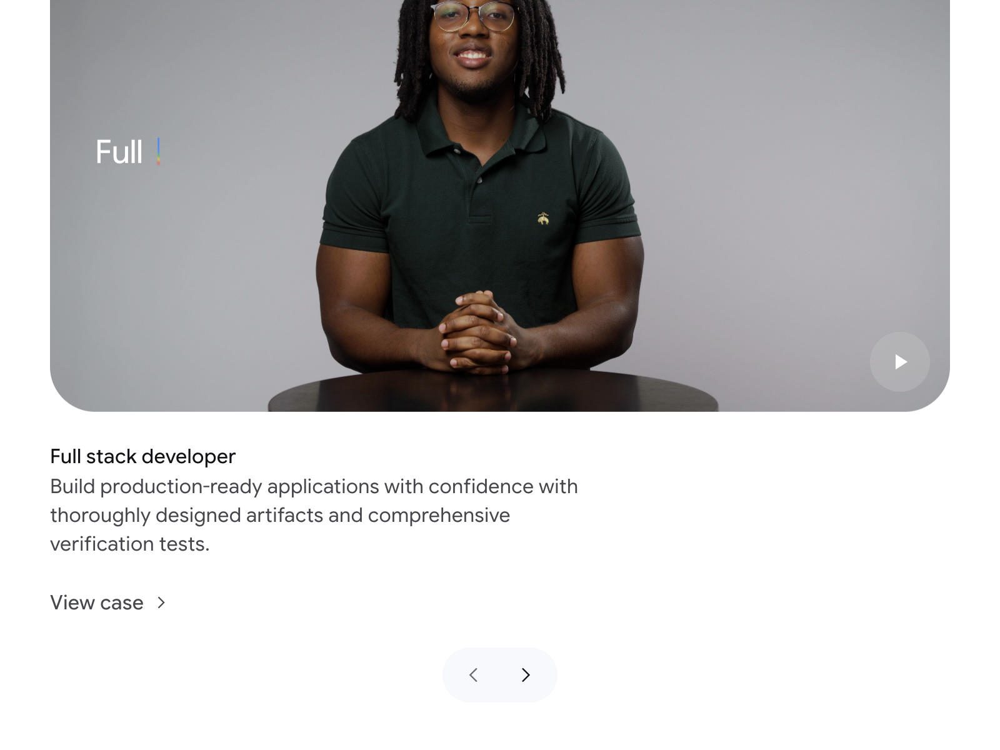
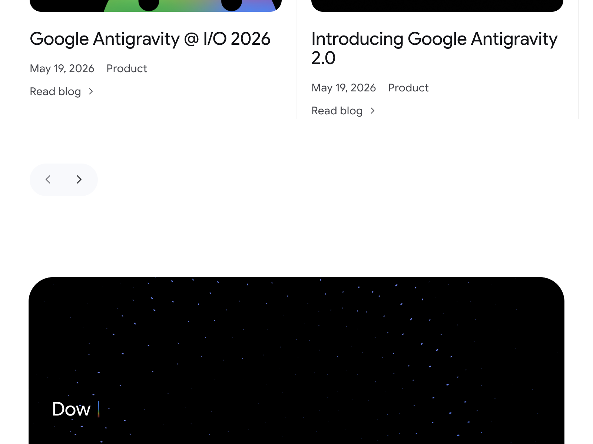
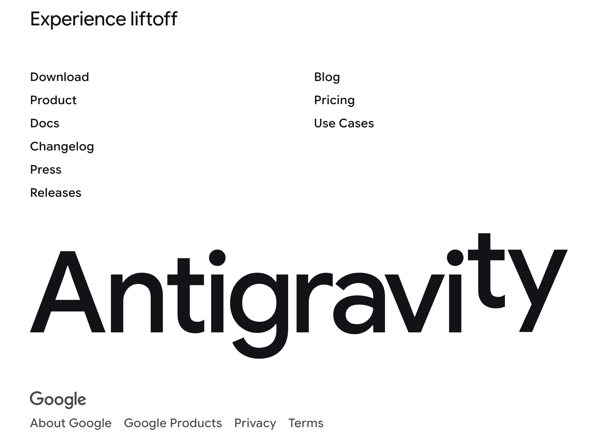

# DESIGN.md: Google Antigravity

## Source
- URL: https://antigravity.google/
- Capture date: 2026-05-27
- Evidence: browser screenshots (6 viewports), CSS custom properties extraction, accessibility tree snapshot

## Reference Screenshots








## Design Summary

Google Antigravity 是一个极简、高端的产品落地页，采用纯白背景 + 深黑文字的高对比度设计语言。整体风格克制、留白充裕，通过超大字号标题、圆角卡片、微妙的粒子动画和深色沉浸式视频区域营造科技感与高级感。页面节奏感强，每个 section 之间有大量呼吸空间，视觉焦点明确。

核心设计理念：**极简 + 沉浸 + 呼吸感**。

---

## Design Tokens

### Colors

#### Primary Palette
| Role | Value | Description |
|------|-------|-------------|
| Surface (背景) | `#FFFFFF` | 纯白主背景 |
| On Surface (主文字) | `#121317` | 近黑色，主标题和正文 |
| On Surface Variant | `#45474D` | 深灰，副文字/描述 |
| Primary Button | `#121317` | 黑色实心按钮 |
| On Primary | `#FFFFFF` | 按钮上的白色文字 |
| Accent Blue | `#3279F9` | Google 蓝，品牌点缀 |

#### Surface System
| Role | Value | Description |
|------|-------|-------------|
| Surface Container | `#F8F9FC` | 极浅灰，卡片/容器背景 |
| Surface Container High | `#EFF2F7` | 浅灰，hover 状态 |
| Surface Container Higher | `#E6EAF0` | 中浅灰，分割线区域 |
| Surface Container Highest | `#E1E6EC` | 较深灰，disabled 状态 |
| Overlay | `rgba(255, 255, 255, 0.95)` | 半透明白色遮罩 |
| Inverse Surface | `#121317` | 深色区域背景（视频、下载区） |
| Inverse On Surface | `#F8F9FC` | 深色区域上的浅色文字 |

#### Grey Palette (完整色阶)
| Token | Value |
|-------|-------|
| Grey 0 | `#FFFFFF` |
| Grey 10 | `#F8F9FC` |
| Grey 15 | `#F0F1F5` |
| Grey 20 | `#EFF2F7` |
| Grey 50 | `#E6EAF0` |
| Grey 100 | `#E1E6EC` |
| Grey 200 | `#CDD4DC` |
| Grey 300 | `#B2BBC5` |
| Grey 400 | `#B7BFD9` |
| Grey 600 | `#AAB1CC4D` (带透明度) |
| Grey 800 | `#45474D` |
| Grey 900 | `#2F3034` |
| Grey 1000 | `#212226` |
| Grey 1100 | `#18191D` |
| Grey 1200 | `#121317` |

#### Outline & Divider
| Role | Value |
|------|-------|
| Outline | `rgba(33, 34, 38, 0.12)` |
| Outline Variant | `rgba(33, 34, 38, 0.06)` |
| Divider | `rgba(33, 34, 38, 0.06)` |

### Typography

#### Font Family
```css
font-family: "Google Sans Flex", "Google Sans", sans-serif;
```

**Fallback recommendation for non-Google projects:**
```css
font-family: "Inter", "SF Pro Display", -apple-system, BlinkMacSystemFont, sans-serif;
```

#### Type Scale
| Token | Size | Line Height | Letter Spacing | Usage |
|-------|------|-------------|----------------|-------|
| xs | 12.5px | 15.5px | 0.11px | 标签、辅助信息 |
| sm | 14.5px | 21.02px | 0.16px | 小字正文、日期 |
| base | 16px | 23px | 0.16px | 正文默认 |
| md | 18px | 23.4px | -0.07px | 稍大正文 |
| lg | 20px | 22.8px | -0.08px | 小标题 |
| xl | 22px | 24.64px | -0.13px | 区块标题 |
| 2xl | 24px | 25.92px | -0.14px | 中标题 |
| 3xl | 26px | 28.08px | -0.26px | 大标题 |
| 4xl | 26px | 28.08px | -0.26px | 大标题变体 |
| 5xl | 28px | 29.6px | -0.28px | 特大标题 |
| 6xl | 32px | 33.92px | -0.64px | 超大标题 |
| 7xl | 34px | 36.04px | -0.68px | 巨大标题 |
| 8xl | 36px | 38.16px | -0.72px | 极大标题 |
| 9xl | 38px | 40.28px | -0.76px | 最大标题 |
| Landing Main | 56px | 56.04px | -1.12px | Hero 主标题 |

#### CTA Typography
| Token | Size | Line Height | Letter Spacing |
|-------|------|-------------|----------------|
| CTA | 16px | 23px | 0.16px |
| CTA Small | 16px | 23px | 0.16px |

#### Weight
- Regular: 400 (正文)
- Medium: 500 (推测，按钮/强调)
- Bold: 700+ (推测，超大标题)

### Spacing And Layout

#### Spacing Scale
| Token | Value | Usage |
|-------|-------|-------|
| none | 0px | — |
| xs | 4px | 最小间距 |
| sm | 8px | 紧凑间距 |
| md | 16px | 默认间距 |
| lg | 24px | 宽松间距 |
| xl | 36px | 区块内间距 |
| 2xl | 48px | 区块间距 |
| 3xl | 60px | 大区块间距 |
| 4xl | 80px | Section 间距 |
| 5xl | 88px | 大 Section 间距 |
| 6xl | 120px | 超大间距 |
| 7xl | 180px | 最大间距 |

#### Layout
| Property | Value |
|----------|-------|
| Page Margin | 40px |
| Grid Columns | 8 |
| Grid Gutter | 40px |
| Nav Height | 52px |
| Max Width (breakpoint-max) | 1600px |

#### Breakpoints
| Token | Value |
|-------|-------|
| xs | 425px |
| sm | 767px |
| md | 1024px |
| lg | 1440px |
| xl / max | 1600px |

#### Border Radius (Shape Corners)
| Token | Value | Usage |
|-------|-------|-------|
| xs | 4px | 小元素 |
| sm | 8px | 输入框、小卡片 |
| md | 16px | 中等卡片 |
| lg | 24px | 大卡片、视频容器 |
| xl | 36px | 特大卡片 |
| 2xl | 48px | 超大圆角 |
| rounded | 9999px | 胶囊按钮 |

---

## Components

### Navigation Bar
- 高度：52px
- 背景：白色/透明
- Logo 左对齐："Google Antigravity" + 彩色 A 图标
- 右侧：汉堡菜单按钮（移动端）
- 固定在顶部，极简风格

### Buttons

#### Primary Button (Download)
```css
background: #121317;
color: #FFFFFF;
border-radius: 9999px; /* 胶囊形 */
padding: 12px 24px;
font-size: 16px;
letter-spacing: 0.16px;
line-height: 23px;
```
- Hover: `#2F3034`（稍微变浅）
- Pressed: `rgba(230, 234, 240, 0.12)` 叠加
- Disabled: `#F8F9FC` 背景 + `#6A6A71` 文字

#### Secondary Button (Explore use cases)
```css
background: transparent;
border: 1px solid rgba(33, 34, 38, 0.12);
color: #121317;
border-radius: 9999px;
padding: 12px 24px;
```
- Hover: `#F0F1F5` 背景

#### Icon Button (Carousel arrows)
```css
background: rgba(183, 191, 217, 0.09);
border-radius: 9999px;
width: 40px;
height: 40px;
```
- Hover: `rgba(183, 191, 217, 0.2)`

### Cards

#### Video/Product Card
```css
background: #121317; /* 深色 */
border-radius: 24px;
overflow: hidden;
```
- 内含粒子动画背景（蓝色/彩色小点散布）
- 右下角播放按钮（圆形深灰）

#### Blog Card
```css
background: transparent;
border-bottom: 1px solid rgba(33, 34, 38, 0.06);
padding: 24px 0;
```
- 标题：lg-xl 字号，黑色
- 日期 + 标签：sm 字号，灰色
- "Read blog >" 链接

#### Feature Icon Card (圆形图标列表)
```css
width: 80px;
height: 80px;
border-radius: 50%;
background: #F8F9FC;
border: 1px solid rgba(33, 34, 38, 0.06);
display: flex;
align-items: center;
justify-content: center;
```
- 内含线性图标（黑色 stroke）

### Use Case Section
- 大圆角视频卡片（24px radius）
- 左上角打字机效果文字（"Full |"）
- 右下角播放按钮
- 下方：标题 + 描述 + "View case >" 链接
- 轮播导航：左右箭头

### Hero Section
- 居中布局
- Logo + 品牌名
- 超大标题（56px，负 letter-spacing）
- 两个并排按钮（Primary + Secondary）
- 背景：白色 + 微妙的彩色粒子散布动画

### Footer
- 两栏链接列表（左：Download/Product/Docs/Changelog/Press/Releases，右：Blog/Pricing/Use Cases）
- 超大装饰文字 "Antigravity"（占满宽度，字号极大，字母间距紧凑，"ty" 上浮效果）
- 底部：Google 品牌 + About/Products/Privacy/Terms 链接

---

## Page Patterns

### Section Order
1. **Hero** — Logo + 大标题 + CTA 按钮（白色背景 + 粒子）
2. **Video** — 深色大圆角卡片，产品演示视频
3. **Feature Explorer** — 圆形图标横向滚动列表，展示功能分类
4. **Product Showcase** — 产品界面截图（浅灰背景卡片，彩虹渐变边框光晕）
5. **SDK Section** — 深色大卡片，蓝色径向渐变光环 + 居中文字
6. **Use Cases** — 视频轮播，开发者使用场景
7. **Blog** — 两列博客卡片 + 轮播
8. **Download CTA** — 深色卡片，重复下载引导
9. **Footer** — 链接 + 超大装饰字

### Layout Rhythm
- 每个 Section 之间间距约 80-120px
- Section 内部间距 36-60px
- 整体内容最大宽度 1600px，居中
- 页面边距 40px

### Responsive Assumptions
- 桌面优先设计（1600px max）
- 移动端：汉堡菜单、单列布局、缩小字号
- 断点：425 / 767 / 1024 / 1440 / 1600

---

## Content Style

### Voice
- 简洁、自信、面向开发者
- 短句为主，避免冗长描述
- 动词驱动："Experience liftoff"、"Build production-ready applications"

### CTA Patterns
- Primary CTA：动作 + 平台（"Download for MacOS"）
- Secondary CTA：探索性（"Explore use cases"）
- 链接式 CTA：文字 + 箭头（"View case >"、"Read blog >"）

### Heading Style
- Hero：2行居中，56px，负 letter-spacing 营造紧凑感
- Section：左对齐或居中，32-38px
- Card：18-22px，单行

### Copy Density
- 极低密度，大量留白
- 描述文字通常 1-2 行
- 不使用长段落

---

## Motion & Interaction

### Observed Animations
- **粒子背景**：Hero 和深色区域有彩色小点缓慢漂浮
- **打字机效果**：Use Case 卡片左上角文字逐字显示 + 闪烁光标
- **径向光晕**：SDK 区域蓝色光环脉动
- **彩虹边框**：产品截图卡片边缘有流动的彩虹渐变光晕

### Easing Functions (from CSS variables)
| Name | Value | Usage |
|------|-------|-------|
| ease-out-quad | `cubic-bezier(.25, .46, .45, .94)` | 通用退出 |
| ease-out-cubic | `cubic-bezier(.215, .61, .355, 1)` | 平滑退出 |
| ease-out-quart | `cubic-bezier(.165, .84, .44, 1)` | 快速退出 |
| ease-out-expo | `cubic-bezier(.19, 1, .22, 1)` | 极速退出 |
| ease-out-back | `cubic-bezier(.34, 1.85, .64, 1)` | 弹性退出 |
| ease-in-out-cubic | `cubic-bezier(.645, .045, .355, 1)` | 通用进出 |
| ease-in-out-quart | `cubic-bezier(.77, 0, .175, 1)` | 平滑进出 |
| ease-in-out-expo | `cubic-bezier(1, 0, 0, 1)` | 极速进出 |

### Interaction Patterns
- Hover：按钮背景色微变、链接颜色加深
- 轮播：左右箭头切换，无自动播放
- 视频：点击播放按钮触发

---

## Agent Build Instructions

要用这套设计语言构建新页面，遵循以下原则：

1. **背景永远是纯白 `#FFFFFF`**，深色区域仅用于特殊展示卡片（视频、下载引导）
2. **文字颜色只用两级**：主文字 `#121317`，副文字 `#45474D`
3. **字体用 Inter 或 SF Pro 替代 Google Sans**，保持负 letter-spacing 的紧凑标题风格
4. **按钮一律胶囊形**（border-radius: 9999px），Primary 黑底白字，Secondary 白底黑字带细边框
5. **卡片圆角 24px**，深色卡片用 `#121317` 背景
6. **间距要大**：Section 间 80-120px，内部 36-60px，页面边距 40px
7. **内容居中**，最大宽度 1600px
8. **留白是设计的一部分**：宁可空着也不要填满
9. **动效克制**：只在关键位置使用（Hero 粒子、打字机、光晕），不要全页面都动
10. **Easing 用 ease-out-expo 或 ease-out-cubic**，让动画感觉快速且自然

---

## Rerun Inputs
```
workflow: firecrawl-website-design-clone
source_url: https://antigravity.google/
target_stack: HTML/CSS/JS
output: DESIGN.md
```
